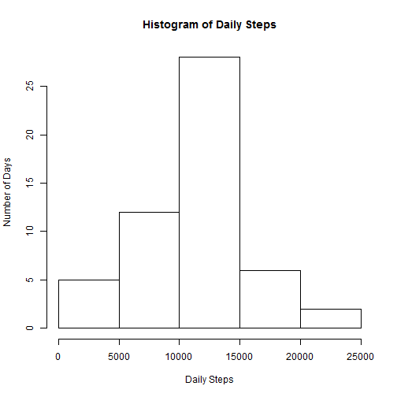
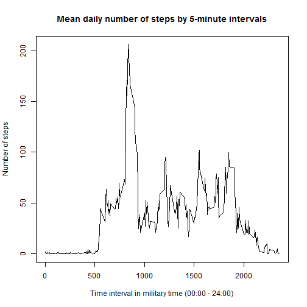
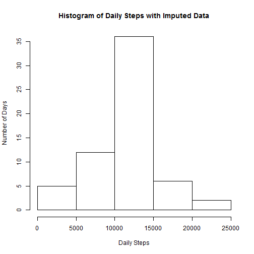

This project is designed to provide experience with knitr. It does some basic statistical analysis on a dataset of readings from a personal activity monitoring device. This device collects data at 5 minute intervals through out the day. The data consists of two months of data from an anonymous individual collected during the months of October and November, 2012 and include the number of steps taken in 5 minute intervals each day.

The data for this assignment can be downloaded from the course web site:

Dataset: [Activity monitoring data, 52K](https://d396qusza40orc.cloudfront.net/repdata%2Fdata%2Factivity.zip) 
The variables included in this dataset are:

- steps: Number of steps taking in a 5-minute interval (missing values are coded as NA)

- date: The date on which the measurement was taken in YYYY-MM-DD format

- interval: Identifier for the 5-minute interval in which measurement was taken

The dataset is stored in a comma-separated-value (CSV) file and there are a total of 17,568 observations in this dataset.

##Part 1: Load and preprocess the data

This assumes that the .zip file containing the data has been downloaded and extracted. This code block first reads the data, then provides a summary of the data. At the moment, there is no other preprocessing performed on this data.


```r
actdata <- read.csv("./activity/activity.csv")
summary(actdata)
```

```
##      steps                date          interval     
##  Min.   :  0.00   2012-10-01:  288   Min.   :   0.0  
##  1st Qu.:  0.00   2012-10-02:  288   1st Qu.: 588.8  
##  Median :  0.00   2012-10-03:  288   Median :1177.5  
##  Mean   : 37.38   2012-10-04:  288   Mean   :1177.5  
##  3rd Qu.: 12.00   2012-10-05:  288   3rd Qu.:1766.2  
##  Max.   :806.00   2012-10-06:  288   Max.   :2355.0  
##  NA's   :2304     (Other)   :15840
```

##Part 2: What is mean total number of steps taken per day?

In this step, the total number of steps taken per day is calculated. NA values are ignored. Then a histogram of the total number of steps taken each day is provided.

Mean and median of the total number of steps taken per day is also calculated and reported. 


```r
cleandata <- na.omit(actdata)
totalsteps <- aggregate(cleandata$steps, by = list(cleandata$date), sum)
hist(totalsteps$x, main = "Histogram of Daily Steps", xlab = "Daily Steps", ylab = "Number of Days")
```

 

```r
stepmean <- mean(totalsteps$x)
stepmedian <- median(totalsteps$x)
```

The mean number of daily steps is **10766**. The median number of daily steps is **10765**. 

To get this reported inline in the text, I used the commands **r as.integer(stepmean)** and **r stepmedian** in the text, as shown in the lecture slides. I used the **as.integer** function to make the variable display cleaner.

## Part 3: What is the average daily activity pattern?

Make a time series plot (i.e. type = "l") of the 5-minute interval (x-axis) and the average number of steps taken, averaged across all days (y-axis).


```r
totalstepsbytime <- aggregate(cleandata$steps, by = list(cleandata$interval), mean)
plot(totalstepsbytime, type = 'l', main = "Mean daily number of steps by 5-minute intervals", xlab = "Time interval in military time (00:00 - 24:00)", ylab = "Number of steps")
```

 


Which 5-minute interval, on average across all the days in the dataset, contains the maximum number of steps?


```r
maxsteps <- subset(totalstepsbytime, x == max(x))
```

The interval with the greatest number of average steps is 835, which has 206.1698113 steps.

## Part 4: Impute missing values

Imputing missing values

Note that there are a number of days/intervals where there are missing values (coded as NA). The presence of missing days may introduce bias into some calculations or summaries of the data.

The first step is to calculate and report the total number of missing values in the dataset (i.e. the total number of rows with NAs)


```r
NArows <- sum(is.na(actdata$steps))
```

The number of rows with missing step data is **2304**.

The following algorithm uses the daily average steps for a given value as the imputed value for filling in NAs to provide a dataset that has no NAs in the step values we are looking at. 


```r
noNAdata <- actdata
noNAdata$mean <- totalstepsbytime$x
noNAdata$imputed <- ifelse(is.na(noNAdata$steps), noNAdata$mean, noNAdata$steps)
```

The next step is to make a histogram of the total number of steps taken each day. 


```r
totalStepsImputed <- aggregate(noNAdata$imputed, by = list(noNAdata$date), sum)
hist(totalStepsImputed$x, main = "Histogram of Daily Steps with Imputed Data", xlab = "Daily Steps", ylab = "Number of Days")
```

 

The next step is to calculate and report the mean and median total number of steps taken per day on the dataset with the imputed data, and compare them against the estimates from the data set with the NAs intact.  


```r
stepmeanImputed <- mean(totalStepsImputed$x)
stepmedianImputed <- median(totalStepsImputed$x)
meandiff <- stepmean - stepmeanImputed
mediandiff <- stepmedian - stepmedianImputed
```

The daily mean with the imputed data is **10766**, and the daily median with the imputed data is **10766**. The difference between the non-imputed and imputed mean is **0** and the difference between the non-imputed and imputed median is **-1.1886792**. Because I'm replacing the NAs with the mean number of steps for each interval, and because the NAs seem to be mostly because the device was not worn on a particular day (providing 24 hour gaps in the data), there is almost no difference between the numbers for the original data set and the data set with imputed values.

##Part 5: Are there differences in activity patterns between weekdays and weekends?

The dataset with the filled-in missing values is being used for this part of the project.

Step 1: Create a new factor variable in the dataset with two levels - "weekday" and "weekend" indicating whether a given date is a weekday or weekend day.


```r
noNAdata$dayofweek <- as.POSIXlt(noNAdata$date)$wday
noNAdata$isWeekday <- as.factor(ifelse(noNAdata$dayofweek > 0 && noNAdata$dayofweek < 6, "weekday", "weekend"))
head(noNAdata)
```

```
##   steps       date interval      mean   imputed dayofweek isWeekday
## 1    NA 2012-10-01        0 1.7169811 1.7169811         1   weekday
## 2    NA 2012-10-01        5 0.3396226 0.3396226         1   weekday
## 3    NA 2012-10-01       10 0.1320755 0.1320755         1   weekday
## 4    NA 2012-10-01       15 0.1509434 0.1509434         1   weekday
## 5    NA 2012-10-01       20 0.0754717 0.0754717         1   weekday
## 6    NA 2012-10-01       25 2.0943396 2.0943396         1   weekday
```

```r
class(noNAdata$isWeekday)
```

```
## [1] "factor"
```

Step 2: Make a panel plot containing a time series plot (i.e. type = "l") of the 5-minute interval (x-axis) and the average number of steps taken, averaged across all weekday days or weekend days (y-axis). See the README file in the GitHub repository to see an example of what this plot should look like using simulated data.

---
title: "Reproducible Research: Peer Assessment 1"
output: 
  html_document:
    keep_md: true
---


## Loading and preprocessing the data


## What is mean total number of steps taken per day?


## What is the average daily activity pattern?


## Imputing missing values


## Are there differences in activity patterns between weekdays and weekends?
